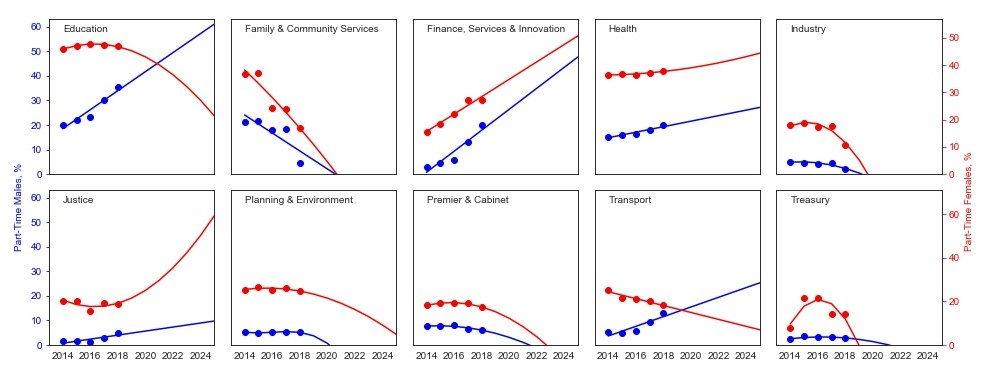

# Analysing Part-Time Employment in the NSW State Government

In the Data Analysis case study under the Virtual Internship Program of the NSW Government (c/o [InsideSherpa](https://www.insidesherpa.com/)), I analysed part-time employment to brief the Director before a meeting with the Workforce Diversity Steering Committee. The meeting aimed to review whether part-time employment arrangements are increasing.

My aim in this internship was to provide:

* Trends over time in male and female employment, including any notable changes
* The current representation of part-time employees in the sector and each cluster
* The current representation of male and female part-time employees as a proportion of the respective male and the female workforce in the sector and each cluster
* Change in these two above statistics over the last 4 years
* Projection of what the representation will be by 2025 if the current trends continue

For the data analysis, I performed the following:

* Explored the dataset
* Determined the variation of male and female employment in the sector from 2014 - 2018
* Obtained the proportion of part-time employees in the sector and each cluster in 2018
* Obtained the proportion of male and female part-time employees in the sector and each cluster in 2018
* Determined the variation of the proportion of male and female part-time employees in the sector and each cluster over time (2014 - 2018)
* Forecasted the variation of the proportion of male and female part-time employees in the sector and each cluster over time (2014 - 2025)

The results show that:

* Male employment in the NSW government indicates upward trend from 2014 - 2018, while female employment shows downward trend. The government employed more women than men in this period.
* In 2018, part-time employees comprised 29.6% of the sector workforce. The clusters of `Education`, `Health`, and `Finance, Services & Innovation` have the highest representation of part-time employees in 2018. Meanwhile, the clusters of `Industry`, `Treasury`, and `Justice` have the lowest representation of part-time employees in 2018.
* About 16.5% of males and 36.7% of females in the sector are part-time employees in 2018. `Education` , `Finance, Services & Innovation`, and `Health`  have the highest representation of male part-time employees in 2018. Meanwhile, `Industry` , `Treasury` , and `Family & Community Services` have the lowest representation of male part-time employees in 2018. For the representation of female part-time employees in 2018, `Education` , `Health` , and `Finance, Services & Innovation` show the highest values while `Industry` , `Treasury`, and `Family & Community Services` indicate the lowest.
* The proportion of males as part-time employees in the sector increased from 2014 - 2018. From the upward trend, male part-time employees could reach 26.8% by 2025. On the other hand, the proportion of females as part-time employees in the sector peaked in 2017 and could decrease to 29% by 2025.
* For the employment of part-time males, 5 out of the 10 clusters (`Education`, `Finance, Services & Innovation`, `Health`, `Justice`, and `Transport`) are predicted to hire more until 2025. For the employment of part-time females, all clusters except `Finance`, `Services & Innovation`, `Health`, and `Justice` are forecasted to hire less until 2025 (see figure below).

For more details, please see the `Data Analysis - Data Sheets.xlsx` Excel file and the full data analysis in the `Project_NSW.ipynb` notebook above.
